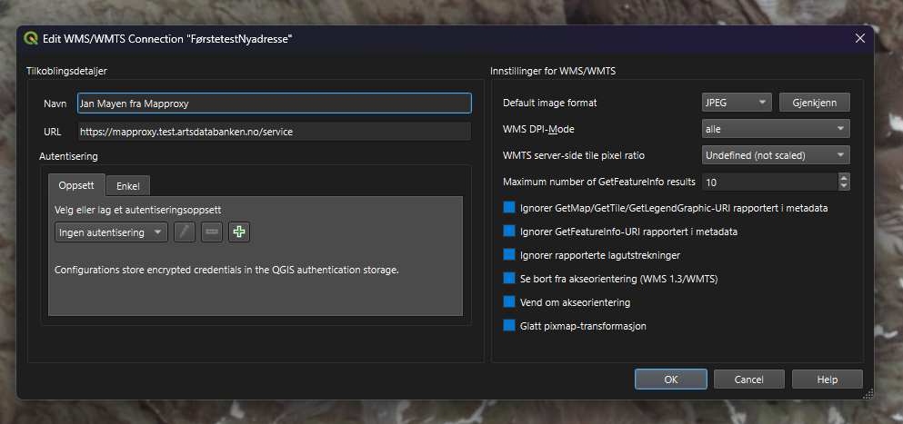

Her kommer litt mer info om Mapproxy.

https://mapproxy.org/

Vi har valgt å bruke mapprpoxy for å reprojisere bildedata for Jan Mayen fra EPSG:25829 til EPSG:25833 fr di vi ønsker å vise bildedata for Jan Mayen samtidig som vi viser bildedata for Svalbard og Norge (norge i bilder).

Jan Mayen sine data ligger ute på https://geodata.npolar.no/arcgis/rest/services/Basisdata/NP_Satellitt_JanMayen_WMTS_25829/MapServer/WMTS/1.0.0/WMTSCapabilities.xml.

Dette er en arcgisservertjeneste som har dataene i sone 29 (EPSG:25829) og tilbyr ikke å se dataene i noen andre projeksjoner. Men med Mapproxy laster vi ned en cache av dataene og tilbyr den reprojisert til EPSG:25833 for vår bruk på Artskart. 

Svalbard er også en arcgisservertjeneste, men denne tilbys i EPSG:28533 og Norge i bilder tilbys i flere koordinatsystem. For mer info EPSG --> https://register.geonorge.no/epsg-koder og https://epsg.io/

Framtidig bruk kan være og tilby en samlet tjeneste for alle disse tre tjenesten delt på de fire områdene Jan Mayen, Svalbard, Bjønøya og fastlands Norge. Men foreløpig er det bare oppsettet under folder: janmayen som er i bruk.

Tjeneste settes opp av to configfiler
- Mapproxy som definerer navn og type, kilder som skal brukes, hvilke cahcher som skal bygges (tile-tjenester) og hvilke grid som skal brukes for å definere zoomnivå.
- Seed som håndterer området som skal hentes ned og inngå i cachene og hvilke grid som skal brukes.

Jan Mayen er ikke det området som oftest har nye data, men det vil være naturlig å laste ned cache miniumum en gang pr år eller når det observeres at det er nyere data. 

Det er aktuelt med et system som automatisk restarter tjenesten om den stopper, men nedlasting bør initieres manuelt for å sjekke at nedlastingen (seedingen) har vært en suksess før piblisering.

I første omgang blir tjensten tilgjengelig på https://mapproxy.test.artsdatabanken.no og etter hvert https://mapproxy.artsdatabanken.no Versjonen vi kjører nå er 6.0.1 kartoza.

Får å hente inn tjenesten som WMTS i qgis eller OpenLayers https://mapproxy.test.artsdatabanken.no/service 

Prosjektet i repo er satt som en dockertjeneste. Tjensten som ligger ute på server er ikke docker og er satt opp manuelt, hvordan dette skal løses best i framtiden er ikke avklart, men vi har flere ssytemer som har samme utfordring.

